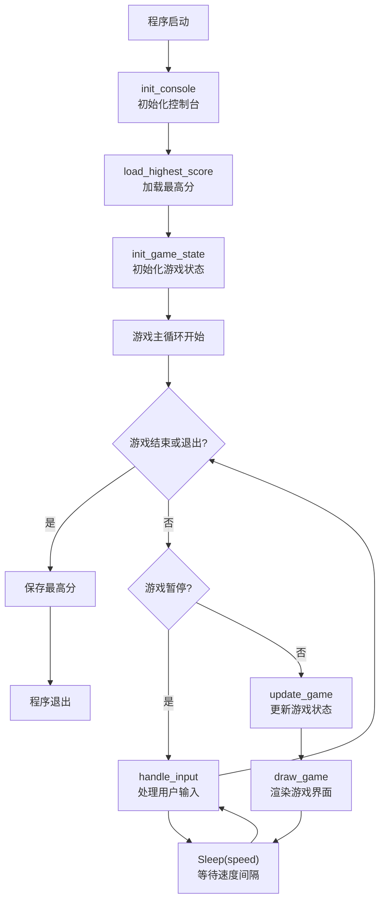
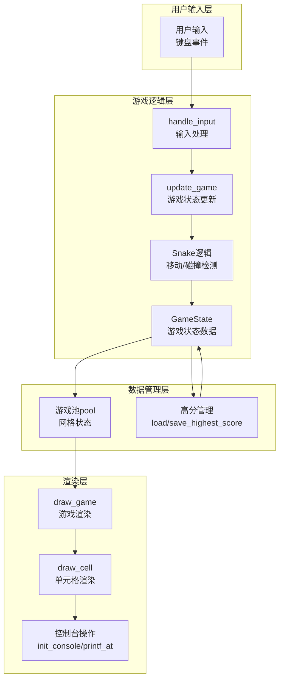
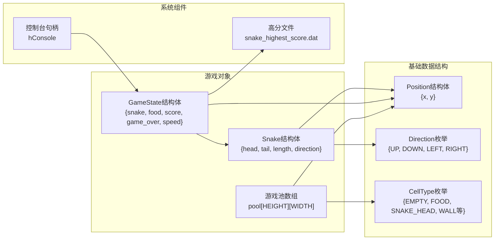

# CLAUDE.md

This file provides guidance to Claude Code (claude.ai/code) when working with code in this repository.

## 项目概述

这是一个使用 C 语言编写的 Windows 控制台贪吃蛇游戏。项目使用 CMake 构建系统，支持 x64/x86 的 Debug/Release 构建配置。基于 Windows API 实现，支持中文显示和完整的游戏逻辑。

## 常用命令

### 构建项目

```bash
# 使用 CMake 预设配置（推荐）
cmake --preset x64-debug
cmake --build out/build/x64-debug

# 查看可用预设
cmake --list-presets

# 传统方式
mkdir build && cd build
cmake .. -G "Ninja"
cmake --build .
```

### 运行游戏

```bash
# 构建后可执行文件位于
./out/build/x64-debug/Snake/Snake.exe

# Windows PowerShell
# .\out\build\x64-debug\Snake\Snake.exe
```

### 清理构建

```bash
# 删除构建目录
rm -rf out/build

# 或使用 CMake 清理
cmake --build out/build/x64-debug --target clean
```

### 测试

项目目前没有配置单元测试框架。所有测试均为手动功能测试。如需添加测试，可考虑集成 CTest 或轻量级测试框架（如 Unity）。

## 构建系统

### CMake 预设配置

项目配置了 4 种预设构建配置（定义于 `CMakePresets.json`）：

- `x64-debug`: 64 位 Debug 版本（默认开发配置）
- `x64-release`: 64 位 Release 版本
- `x86-debug`: 32 位 Debug 版本
- `x86-release`: 32 位 Release 版本

所有预设使用 Ninja 作为生成器，MSVC (cl.exe) 作为编译器，并启用 UTF-8 编码支持。

### 编译器设置

- 编译器：MSVC (cl.exe) 或 GCC/Clang（跨平台选项）
- C 标准：C11
- 编码：UTF-8 支持已启用（MSVC: `/utf-8`，GCC/Clang: `-finput-charset=UTF-8 -fexec-charset=UTF-8`）
- 生成器：Ninja

## 代码架构

### 文件结构

```text
Snake/
├── CMakeLists.txt          # 顶层 CMake 配置
├── CMakePresets.json       # CMake 构建预设
├── Snake/                  # 源代码目录
│   ├── CMakeLists.txt      # 子项目 CMake 配置
│   └── Snake.c             # 主源代码文件（所有游戏逻辑，1143 行）
└── out/                    # 构建输出目录
```

### 关键常量

定义于 `Snake/Snake.c` 文件开头：

- `GAME_WIDTH` / `GAME_HEIGHT`: 可玩区域尺寸（20×20）
- `POOL_WIDTH` / `POOL_HEIGHT`: 游戏池尺寸（包括边框，22×22）
- `CONSOLE_WIDTH` / `CONSOLE_HEIGHT`: 控制台缓冲区尺寸（80×30）
- `GAME_AREA_X` / `GAME_AREA_Y`: 游戏区域在控制台中的起始位置（8,4）
- `GAME_TITLE`: 游戏标题（"贪吃蛇游戏 - 文字版"）

### 设计模式

#### 1. 游戏池模型

- 使用二维数组 `pool[POOL_HEIGHT][POOL_WIDTH]` 表示游戏网格
- 每个单元格存储 `CellType` 枚举值（空、食物、蛇头、蛇身、蛇尾、墙壁）
- 坐标转换函数将游戏池坐标映射到控制台显示位置

#### 2. 增量渲染系统

- 使用 `dirty[POOL_HEIGHT][POOL_WIDTH]` 布尔数组标记需要更新的单元格
- 减少屏幕闪烁，提高渲染效率
- 状态变量（`last_score`, `last_speed`, `last_paused`）跟踪 UI 变化

#### 3. 输入缓冲机制

- `Snake` 结构体包含 `direction`（当前方向）和 `next_direction`（下一方向）
- 防止蛇连续反向移动导致立即死亡
- 在 `update_game()` 中应用缓冲的方向

#### 4. 集中式状态管理

- `GameState` 结构体包含所有游戏状态：蛇、食物、分数、暂停状态、速度、最高分
- 全局 `game` 变量作为单一状态源
- 高分持久化到 `snake_highest_score.dat` 二进制文件

#### 5. 游戏主循环

位于 `main()` 函数中：

```c
while (!exit_requested) {
    if (!game.paused && !game.game_over) {
        update_game();
        draw_game();
        Sleep(game.speed);
    }
    handle_input();
}
```

### 核心数据结构

- `Position`: 二维坐标 `{x, y}`
- `Direction`: 枚举 `{DIR_UP, DIR_DOWN, DIR_LEFT, DIR_RIGHT}`
- `CellType`: 单元格类型枚举（特殊十六进制值便于调试）
- `Snake`: 蛇状态（头尾位置、长度、方向、输入缓冲）
- `GameState`: 游戏全局状态

### 代码模块

所有函数在 `Snake.c` 中按功能分组：

1. **控制台操作** (`init_console`, `printf_at`, `clear_screen`)

   - Windows API 封装，支持宽字符和 UTF-8
   - 定位输出和颜色控制

2. **游戏池管理** (`init_pool`, `set_cell_type`, `get_cell_type`, `draw_cell`)

   - 网格状态管理
   - 坐标转换：游戏池坐标 ↔ 控制台坐标

3. **游戏逻辑** (`init_game_state`, `update_game`, `generate_food`, `draw_game`)

   - 状态初始化
   - 蛇移动和碰撞检测
   - 食物生成和计分
   - 游戏暂停/继续

4. **输入处理** (`handle_input`)

   - WASD/方向键控制
   - 暂停（P）、退出（Q/ESC）、重玩（R）功能

5. **高分管理** (`load_highest_score`, `save_highest_score`, `update_highest_score`)

   - 二进制文件持久化
   - 自动加载和保存

6. **游戏重置** (`reset_game`)
   - 不重启程序的情况下重玩游戏

### 系统架构图

#### 游戏主循环流程图



#### 模块关系图



#### 数据结构关系图



## 平台依赖

### Windows 专用 API

项目使用以下 Windows 特有头文件：

- `<windows.h>`: Windows API
- `<conio.h>`: 控制台输入输出
- 标准 C 库头文件

### Unicode 支持

- 宽字符 (`wchar_t`) 和宽字符串 (`L"..."`)
- 设置控制台代码页为 UTF-8
- 区域设置为 `zh_CN.UTF-8`

## 开发工作流

### 修改游戏参数

1. **调整游戏速度**：

   - 初始速度：修改 `init_game_state()` 中的 `game.speed = 120`（毫秒）
   - 速度变化逻辑：修改 `update_game()` 中的速度增量（每 50 分减少 10 毫秒，最低 30 毫秒）

2. **调整游戏区域尺寸**：

   - 修改 `GAME_WIDTH` 和 `GAME_HEIGHT` 常量
   - 重新计算 `POOL_WIDTH` / `POOL_HEIGHT`
   - 可能需要调整 `GAME_AREA_X` / `GAME_AREA_Y` 以保持居中

3. **修改控制台布局**：
   - 调整 `CONSOLE_WIDTH` / `CONSOLE_HEIGHT`
   - 更新 `GAME_AREA_X` / `GAME_AREA_Y` 使游戏区域居中

### 调试技巧

- Debug 版本包含调试信息，可使用 Visual Studio 调试器
- 使用 `printf_at()` 在控制台特定位置输出调试信息
- 注意宽字符字符串使用 `L"..."` 格式
- 游戏池单元格使用特殊十六进制值，可在调试器中识别

### 扩展建议

1. **代码拆分**：将声明移动到 `Snake.h`，实现保持在 `Snake.c`
2. **跨平台支持**：使用 ncurses 或类似的跨平台控制台库
3. **测试框架**：添加 CTest 或 Unity 测试
4. **功能增强**：难度级别、更多游戏模式、声音效果（Windows Beep API）
5. **图形改进**：使用更丰富的字符图形或颜色组合

## 注意事项

1. **平台限制**：代码仅适用于 Windows 平台，依赖 Windows API 和 MSVC 编译器
2. **单一文件架构**：所有代码在一个文件中，便于理解和修改但不利于大型项目
3. **控制台图形**：使用控制台 API 实现简单图形界面，非 GUI 应用
4. **编码规范**：代码使用中文注释和变量名，注意 UTF-8 编码一致性
5. **开发环境**：推荐使用 Visual Studio 或 VS Code 配合 CMake 工具进行开发
